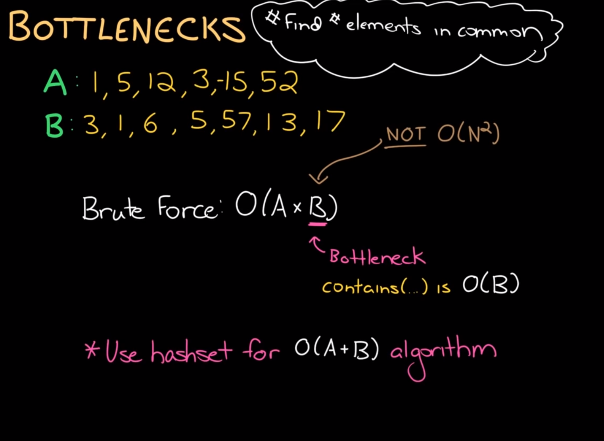
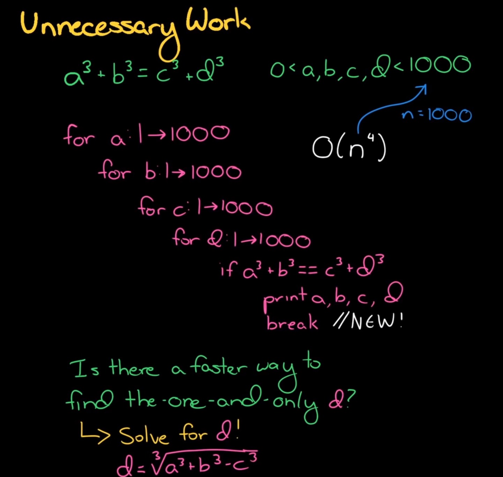
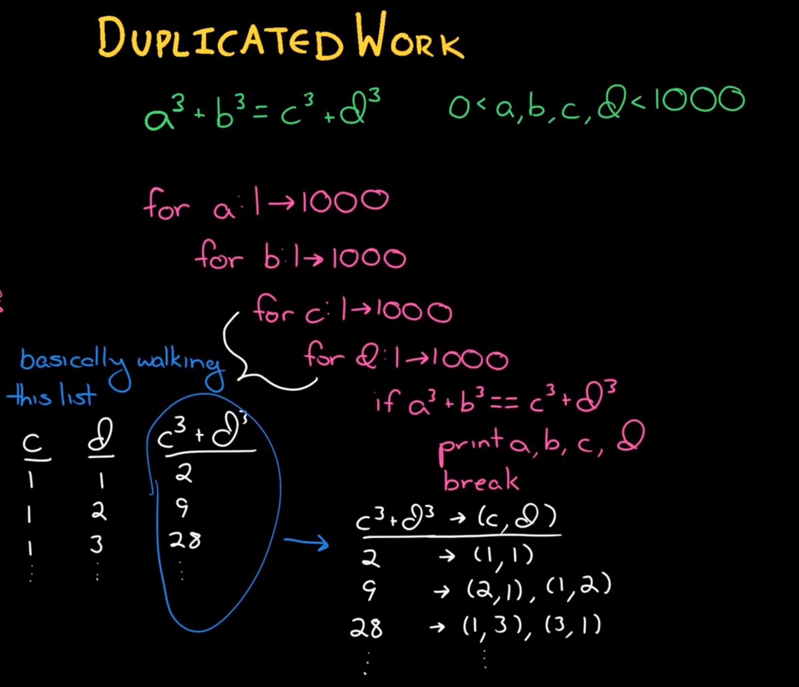
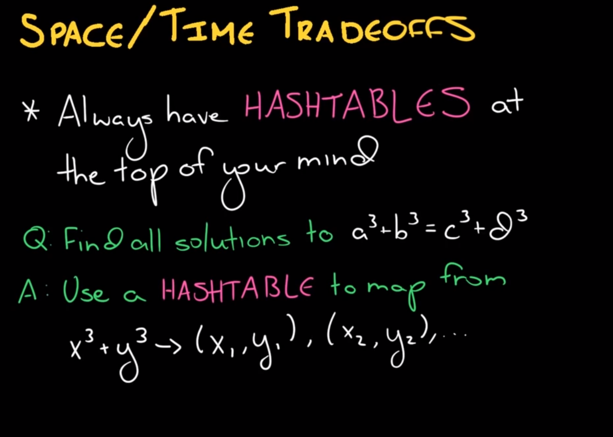
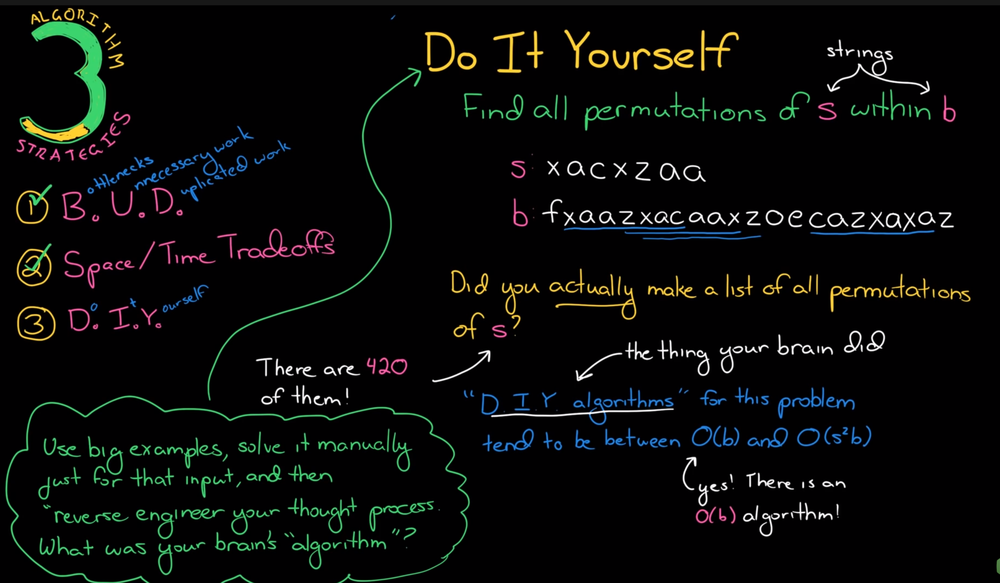

# Algorithm Strategies
[HackerRank](https://www.youtube.com/watch?v=84UYVCluClQ&list=PLX6IKgS15Ue02WDPRCmYKuZicQHit9kFt&index=2)
## B.U.D
- Bottlenecks
- Unnecessary Work
- Duplicated Work

### Bottlenecks

### Unnecessary Work

### Duplicated Work

## Space/Time Tradeoffs
Always have hash tables at the top of your mind. You can save time by adding space.

## DIY

