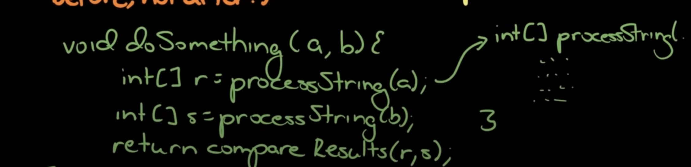

# Algorithms

## 7 Steps to solve a problem
1. Listen
Typically, every detail is needed to solve the problem. So if you solve a problem without using a detail in the question, you might need that to solve it optimally.
2. Make an example
   Most times, people make examples too small and with special cases. You should go out of your way to make examples larger and avoiding special cases.
3. Brute force Implementation
   It's better to have a brute force answer than nothing at all. This enforces that you understand the problem, shows your at least good enough to get that, and it's a good starting place to optimize from. DON'T CODE IT. State the method, it's runtime (big O) and optimize
4. Optimize
5. Walk through your algorithm
   Know exactly what your going to do before coding. What variables and data structures? How, when and why do they change? What is the structure of your code?
6. Code it
   - Whiteboard
      - Write straight
      - Use space wisely. Erase what you don't need, it's ok to use arrows, write in top left corner
   - Whiteboard or Computer
     - Coding style matters; Consistent braces, consistent variable naming, consistent spaces, descriptive variables
     - Modularize (before not after). Push any chunks of your code to separate functions
      
7. Test
   1. Analyze
      - Think about each line
      - Double check things that look weird/risky (for loops that decrement, math, etc.)
   2. Use test cases
      - Small test cases first. It's faster to run and you will probably be more thorough.
      - Edge cases
      - Big test cases
   3. Remember to think as you test. Test your code, not your algorithm. Think before you fix bugs. Don't panic!

## Strategies
[[algorithm-strategies]]

[//begin]: # "Autogenerated link references for markdown compatibility"
[algorithm-strategies]: algorithm-strategies.md "algorithm-strategies"
[//end]: # "Autogenerated link references"
