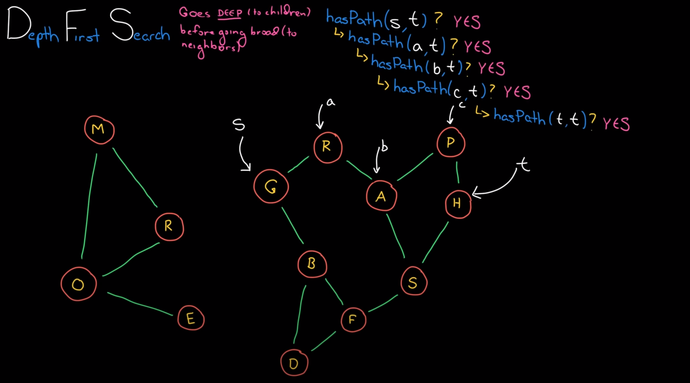

# Graph Search

## Overview
A graph is a collection of nodes. Each node might point to other nodes. The edges can be directed, like one way streets, or undirected, like two way streets. 

## Depth-First Search
Go deep to children before going broad to neighbors


## Breadth-First Search
Go level by level outward


## Implementation

```java
  public class Graph {
    private HashMap<Integer, Node> nodeLookup = new HashMap<Integer, Node>();

    public static class Node {
      private in id;
      LinkedList<Node> adjacent = new LinkedList<Node>();
      private Node(int id) {
        this.id = id;
      }
    }

    private Node getNode(int id) {

    }

    public void addEdge(int source, int destination) {
      Node s = getNode(source);
      Node d = getNode(destination);
      s.adjacent.add(d);
    }

    public boolean hasPathDFS(int source, int destination) {
      Node s = getNode(source);
      Node d = getNode(destination);
      HashSet<Integer> visited = new HashSet<Integer>();
      return hasPathDFS(s, d, visited);
    }

    public boolean hasPathDFS(Node source, Node destination, HashSet<Integer> visited) {
      if (visited.contains(source.id)) return false;

      visited.add(source.id);
      if (source == destination){
        return true;
      }
      for (Node child : source.adjacent) {
        if (hasPathDFS(child, destination, visited)) {
          return true;
        }
      }
      return false;
    }

    public boolean hasPathBFS(int source, int destination) {
      return hasPathBFS(getNode(source), getNode(destination))
    }

    private boolean hasPathBFS(Node source, Node destination) {
      LinkedList<Node> nextToVisit = new LinkedList<Node>();
      HashSet<Integer> visited = new HashSet<Integer>();
      nextToVisit.add(source);

      while(!nextToVisit.isEmpty()) {
        Node node = nextToVisit.remove();
        if (node == destination) {
          return true;
        }

        if (visited.contains(node.id)) {
          continue;
        }

        visited.add(node.id);

        for (Node child : node.adjacent) {
          nextToVisit.add(child);
        }
      }
      return false;
    }
  }

```
