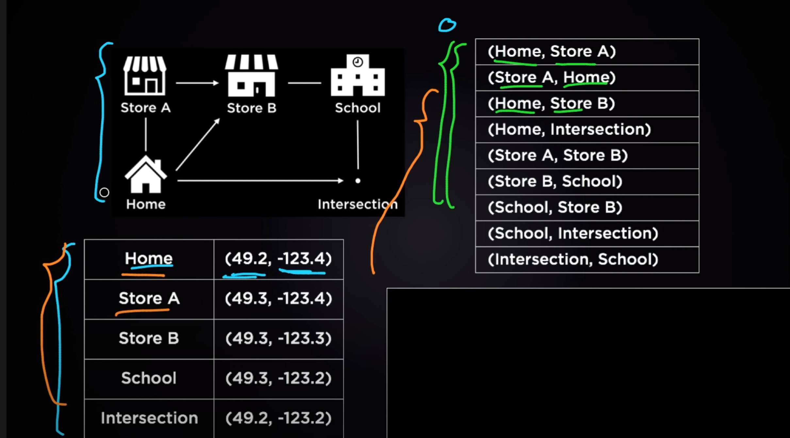
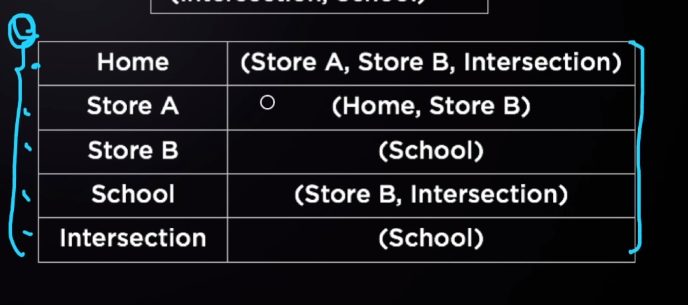

# Data Structures
- Dynamic Arrays [[dynamic-arrays]]
- Linked Lists [[linked-list]]
- Trees [[trees]]
- Heaps [[heaps]]
- Hash Table [[hash-tables]]
- Stacks and Queues [[stacks-and-queues]]
- Tries [[tries]]

## What are Data structures
[video](https://www.youtube.com/watch?v=bum_19loj9A)
They are different ways to store data. 

There are certain paths that can be taken and we can display that data in lists of pairs.

You can also store information like this where each location lists all the paths it can go to.

## What are algorithms
The set of instructions that are performed on different data structures.

[//begin]: # "Autogenerated link references for markdown compatibility"
[dynamic-arrays]: dynamic-arrays.md "Dynamic Arrays"
[linked-list]: linked-list.md "Linked List"
[trees]: trees.md "Trees"
[heaps]: heaps.md "Heaps"
[hash-tables]: hash-tables.md "Hash Table"
[stacks-and-queues]: stacks-and-queues.md "Stacks and Queues"
[tries]: tries.md "tries"
[//end]: # "Autogenerated link references"
