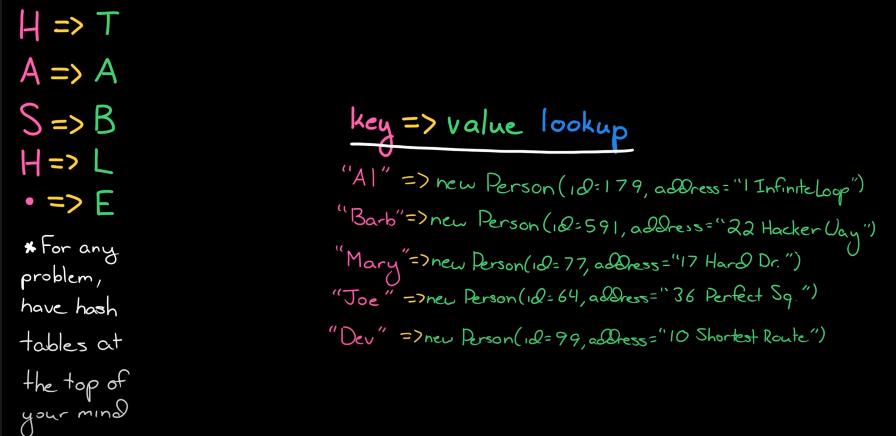
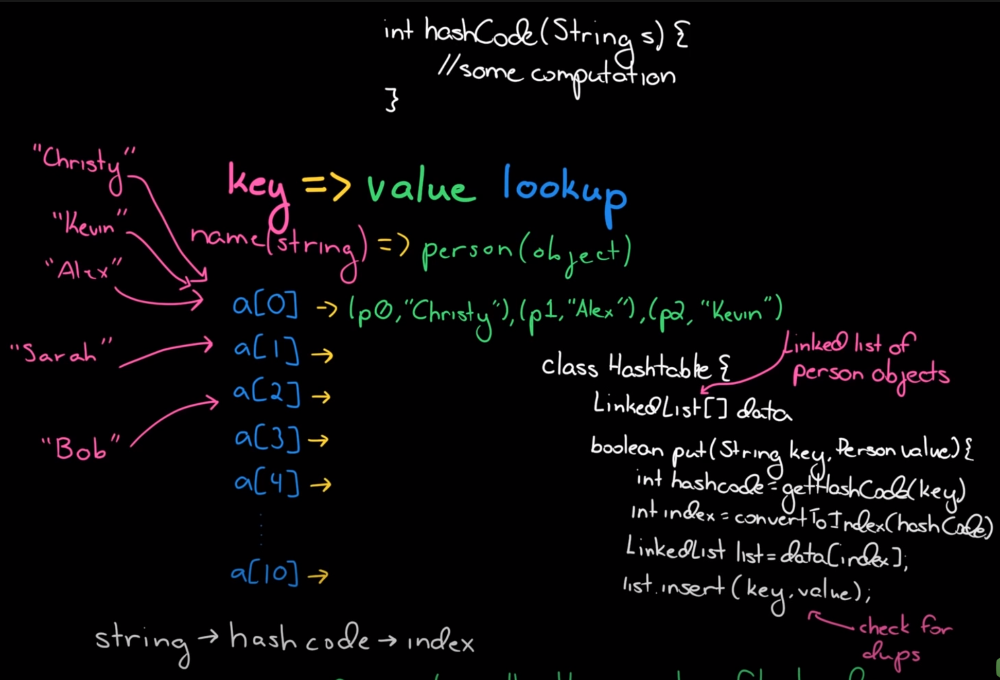

# Hash Table
[HackerRank](https://www.youtube.com/watch?v=shs0KM3wKv8)
[csDojo](https://www.youtube.com/watch?v=sfWyugl4JWA)
## Overview
For any problem, have hash tables at the top of your mind. At a high level, it is a key, value look up.


Gets and puts are very simple. 

## Implementation
At a high level, we are putting them in an array. A hash function is what jumps from the string to it's value. The hash function takes in a string, converts it to some integer(hash code), then remaps that integer into an index in the array. The array that stores the data in the hash table might be smaller than all potential hash codes. We don't want an array the size of 3 billion, so we make it much smaller. 

## Collisions
 Two different strings could have the same hashcode. This is because there are a finite number of hashcodes. When this happens, it is called a collision.

### Ways to resolve
#### Chaining
Chaining means to store the values in a Linked List. When the call is made to get such a value, you actually need to look through the list and get the value you need. The linked list also contains the original keys. If you don't do this, then when you try to get a value, you wouldn't know which one they are.
 - Insertion: O(1)
 - Search: O(1+<html>&alpha;</html>)

#### Open Addressing or Linear Probing
You should use this approach if you don't want to use another data structure in your array. Essentially, if you find a collision, you look at array positions to the right. If it's empty, place it there. It could take a long time to find an open position if your array is full.

#### Double hashing
*pending*

```java
  class HashTable {
    LinkedList[] data
    
    boolean put(String key, String value) {
      int hashCode = getHashCode(key)
      int index = convertToIndex(hashCode)

      LinkedList list = data[index]
      list.insert(key, value)
    }
  }
```


## Runtime
- O(1) for a "good" hashtable - generally assumed for interviews
- O(n) for a terrible hashtable - if there are lots of collisions

## Hash Algorithms
http://www.cse.yorku.ca/~oz/hash.html

 - djb2
  ```c++
  unsigned long
  hash(unsigned char *str)
  {
    unsigned long hash = 5381;
    int c;

    while (c = *str++)
        hash = ((hash << 5) + hash) + c; /* hash * 33 + c */

    return hash;
  }
  ```
  or
  `hash(i) = hash(i - 1) * 33 ^ str[i];`
 - sdbm
  ```c++
  static unsigned long
  sdbm(str)
  unsigned char *str;
  {
      unsigned long hash = 0;
      int c;

      while (c = *str++)
          hash = c + (hash << 6) + (hash << 16) - hash;

      return hash;
  }
  ```
 - lose lose (terrible)
  ```c++
  unsigned long
  hash(unsigned char *str)
  {
    unsigned int hash = 0;
    int c;

    while (c = *str++)
      hash += c;

    return hash;
  }
  ```
