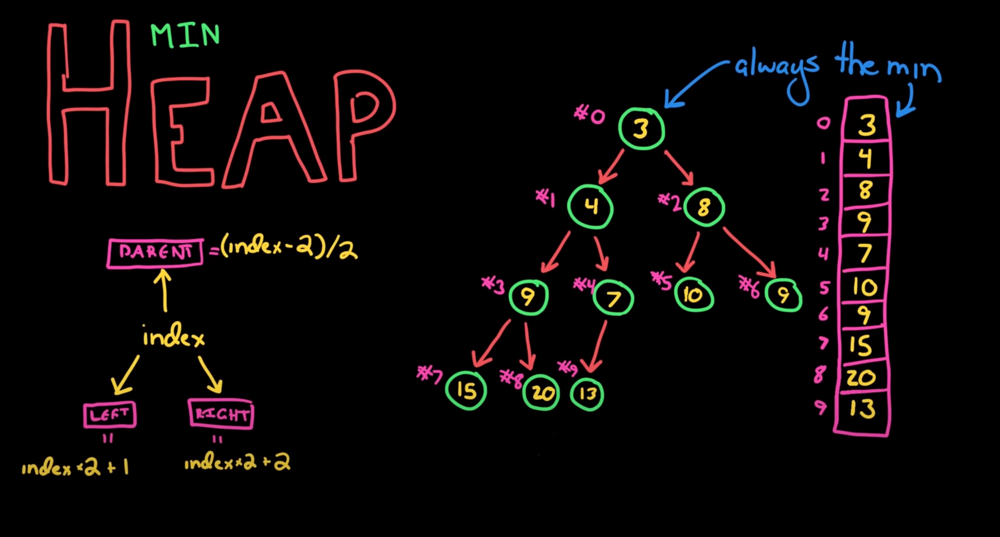

# Heaps
[HackerRank](https://www.youtube.com/watch?v=t0Cq6tVNRBA)

## Overview
There are min and max heaps. Min heaps are where the root node is always the smallest value than their children. Looking down the heap, the numbers get larger and larger.

### Insertion
It always goes to the next empty spot from top to bottom, left to right. If that isn't where it should go, it's inserted as expected, then it's bubbled up to where it needs to be.

### Removing minimum element
We know that is the root, so we can remove that value, then swap it with the last element added. Then we can bubble it down to the last spot. We can do that by checking it's children and swapping it with the smaller value, continuing all the way down.

## Implementation
We can implement it with a left and a right node, but there is a better way. We know that when we add elements, they are always added in a particular spot. There are no gaps. This means we can use an array to store these values, making it very compact. The algorithm then to find the left and right nodes is very simple as well as finding the parent.
- Left node = index * 2 + 1
- Right node = index * 2 + 2
- Parent node = (index - 2) / 2


```java
public class MinIntHeap {
  private in capacity = 10;
  private int size = 0;

  int[] items = new int[capacity];
  private int getLeftChildIndex(int parentIndex) { return 2 * parentIndex + 1; }
  private int getRightChildIndex(int parentIndex) { return 2 * parentIndex + 2; }
  private int getParentIndex(int childIndex) { return (childIndex - 1) / 2; }
  
  private boolean hasLeftChild(int index) { return getLeftChildIndex(index) < size; }
  private boolean hasRightChild(int index) { return getLeftChildIndex(index) < size; }
  private boolean hasParent(int index) { return getParentIndex(index) >= 0; }

  private int leftChild(int index) { return items[getLeftChildIndex(index)]; }
  private int rightChild(int index) { return items[getRightChildIndex(index)]; }
  private int parent(int index) { return items[getParentIndex(index)]; }

  private void swap(int indexOne, inte indexTwo) {
    int temp = items[indexOne];
    items[indexOne] = items[indexTwo];
    items[indexTwo] = temp;
  }

  private void ensureExtraCapacity() {
    if (size == capacity) {
      items = Arrays.copyOf(items, capacity * 2);
      capacity *= 2;
    }
  }

  // returns minimum element or root element
  public int peek() {
    if (size == 0) throw new illegalStageException();
    return items[0];
  }

  // extracts root and removes it from array
  public int extractMin() {
    if (size == 0) throw new illegalStageException();
    int item = items[0]
    items[0] = items[size - 1];
    size--;
    heapifyDown();
    return item;
  }

  // Add element to array
  public void add(int item) {
    ensureExtraCapacity();
    items[size] = item;
    size++;
    heapifyUp();
  }

  public void heapifyUp() {
    int index = size - 1;
    while (hasParent(index) && parent(index) > items[index]) {
      swap(getParentIndex(index), index);
      index = getParentIndex(index);
    }
  }

  public void heapifyUp() {
    int index = 0;
    // we only need to check left child because if there is no left, there is no right
    while(hasLeftChild(index)) {
      int smallerChildIndex = getLeftChildIndex(index);
      if (hasRightChild(index) && rightChild(index) < leftChild(index)) {
        smallerChildIndex = getRightChildIndex(index);
      }

      if (items[index] < items[smallerChildIndex]) {
        // everything is fine, we can break out;
        break;
      } else {
        swap(index, smallerChildIndex);
      }
      index = smallerChildIndex;
    }
  }
}
```
