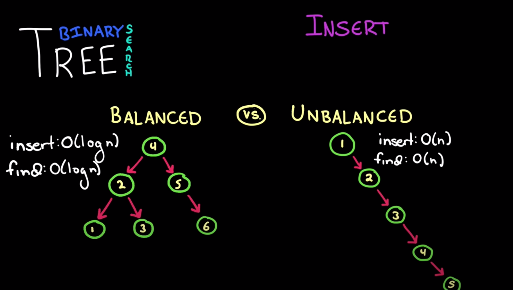
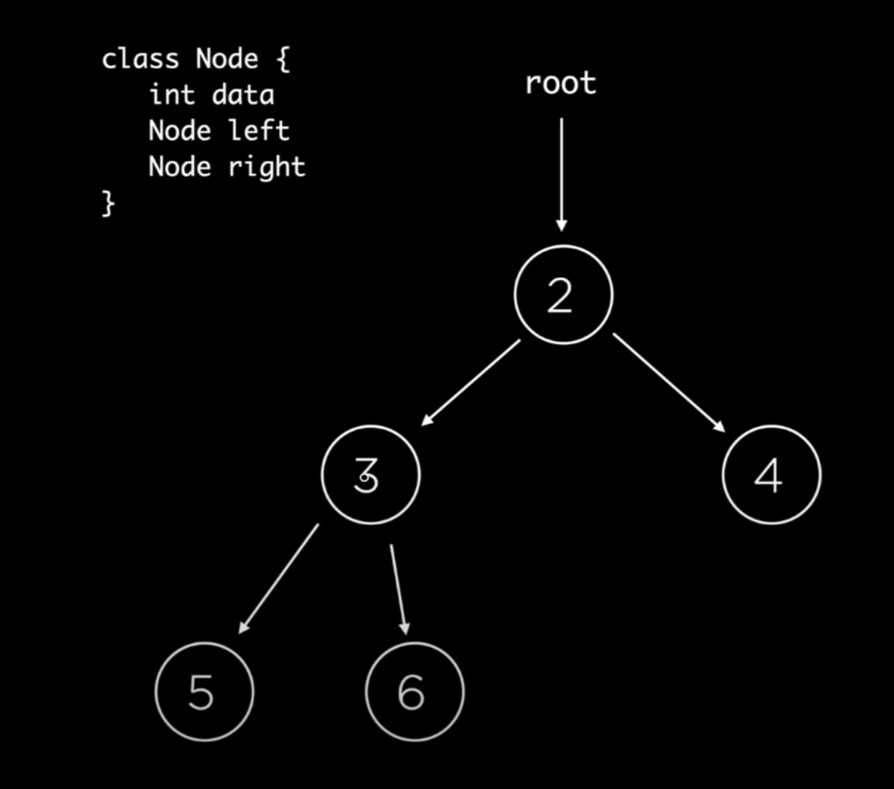

# Trees
[HackerRank](https://www.youtube.com/watch?v=oSWTXtMglKE)

## Overview
You have a root node and that root node has child nodes. Those child nodes can have more child nodes or become leafs which mean they do not reference any other child node. 

## Binary Tree
This means that each node has no more than 2 child nodes, right and left (which can be both null). Most of the time when we talk about binary trees, we are talking about binary search trees.

### Binary Search Tree
Binary tree which fulfills a specific ordering property. On any subtree, the left nodes are less than the root node and right nodes are bigger than the root node. This makes finding a node really fast. Inserts follows the same traversal when we are finding a node. 

Binary search trees can be unbalanced, which means that when we are inserting, if we are getting them in order, they can continue being inserted on the right side, leading to a linear tree. This means that inserts and finds are no longer that fast. There are algorithms that ensure our tree stays balanced, but they are complex and are built into some programming languages


### Traversing
There are 3 different types
- Preorder - You visit the root first then visit it's left nodes, then it's right nodes.
- Inorder - you visit the left nodes first, then the root node, then the right nodes.
- Postorder - you visit the left nodes first, then the right nodes, then the root node.

Typically, you would do an inorder traversal because that allows the values to be printed out properly.

### Implementation
```java
class Node {
  Node left, right;
  int data;
  public Node(int data) {
    this.data = data;
  }

  public void insert(int value) {
    if (value <= data) {
      if (left == null) {
        left = new Node(value);
      } else {
        left.insert(value);
      }
    } else {
      if (right == null) {
        right = new Node(value);
      } else {
        right.insert(value);
      }
    }
  }

  public boolean contains(int value) {
    if (value == data) {
      return true;
    } else if (value < data) {
      if (left == null) {
        return false;
      } else {
        left.contains(value);
      }
    } else {
      if (right == null) {
        return false;
      } else {
        return right.contains(value);
      }
    }
  }

  public void printInOrder() {
    if (left != null) {
      left.printInOrder();
    }
    System.out.println(data);
    if (right != null) {
      right.printInOrder()
    }
  }
}
```

### Problem

```python
Given the above tree, create a function to find the sum of a tree
find_sum(root) -> 20

def find_sum(root):
  if root == null:
    return 0
  return root.data + find_sum(root.left) + find_sum(root.right)
```
Complexity: O(n)
