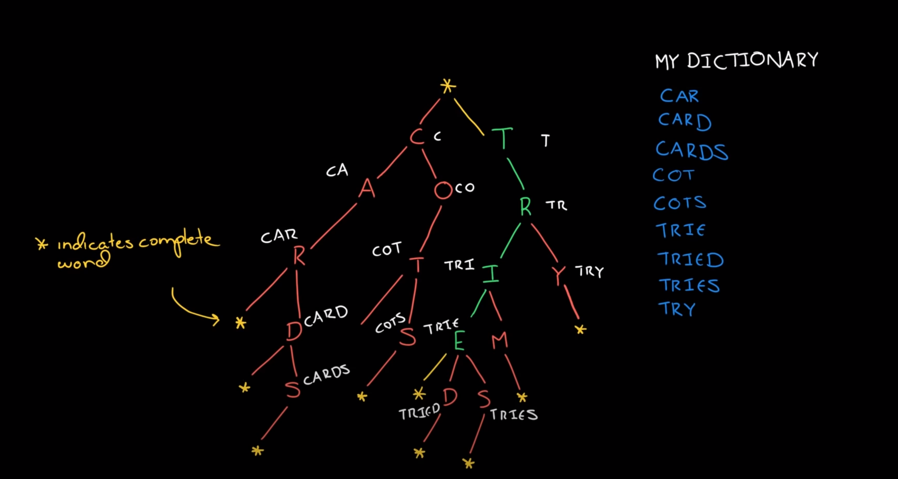
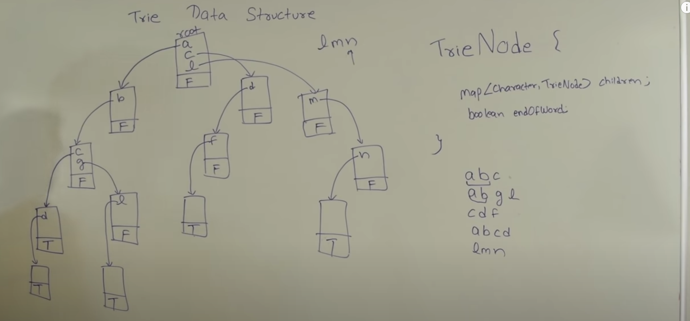

# Tries

## Overview
A type of tree that is often used to store characters. Each node may store a character as it's value. As we navigate down the tree on a particular branch, we can see that it represents a word or part of a word. It allows us to do look ups of a particular kind. We can use it to find if any words exist with a particular prefix 


Don't look up each prefix from the root, build up on past calls (keep state)
- Keep state within tree
- Return node reference

## Used for
- Word Validation
- Prefix-based searching

## Insertion
For a word 'word', we can check if the root node is null. If so, we can create a new trie `TrieNode`, update the root character to 'w' and set the hash. Then we set the pointer to the next letter 'o'. Now we can repeat by creating a new trie `TrieNode`, update the current node with a value of 'o' and set the hash. We can repeat this process until the word is done. We create the final node, which will not have a value, but `isCompleteWord` is set to true


## Time Complexity
 - Insertion - O(n*m)
   - m is average length of words
   - n is number of words
 - Searching - O(n)
   - n is length of word
 - Deletion - O(n*m) same as insertion

## Implementation
```java
public class Trie {
  private class TrieNode {
    HashMap<Character, TrieNode> children;
    boolean isCompleteWord;
    public TrieNode() {
      children = new HashMap<>();
      isCompleteWord = false;
    }
  }

  private final TrieNode root;
  public Trie() {
    root = new TrieNode();
  }

  // Iterative approach
  public void insert(String word) {
    TrieNode current = root;
    for (int i = 0; i < word.length(); i++) {
      char ch = word.charAt(i);
      TrieNode node = current.children.get(ch)
      if (node == null) {
        node = new TrieNode();
        current.children.put(ch, node)
      }
      current = node;
    }
    current.isCompleteWord = true;
  }
  
  // Recursive insertion
  public void insertRecursive(String word) {
    insertRecursive(root, word, 0);
  }

  private void insertRecursive(TrieNode current, String words, int index) {
    if (index == word.length()) {
      // if end of word is reached the mark end of word is true
      current.isCompleteWord = true;
      return;
    }

    char ch = word.charAt(index);
    TrieNode node = current.children.get(ch);

    // if node does not exist in map then create one and put it in map
    if (node == null) {
      node = new TrieNode();
      current.chilren.put(ch, node);
    }
    insertRecursive(node, word, index + 1)
  }

  // Iterative search
  public boolean search(String word) {
    TrieNode current = root;
    for (int i = 0; i < word.length(); i++) {
      char ch = word.charAt(i);
      TrieNode node = current.chilren.get(ch);
      // if node doesn't exist for ch, return false
      if (node == null) {
        return false;
      }
      current = node;
    }
    return current.isCompleteWord;
  }

  public boolean searchRecursive(String word) {
    return searchRecursive(root, word, 0);
  }

  private boolean searchRecursive(TrieNode current, String word, int index) {
    if (index == word.length()) {
      return current.isCompleteWord;
    }

    char ch = word.charAt(index);
    TrieNode node = current.children.get(ch);
    // if node does not exist for ch, return false
    if (node == null) {
      return false;
    }

    return searchRecursive(node, word, index + 1)
  }

  public void delete(String word) {
    delete(root, word, 0);
  }

  private boolean delete(TrieNode current, String word, int index) {
    if (index == word.length()) {
      // when end of word is reached only delete if current.isCompleteWord is true
      if (!current.isCompleteWord) {
        return false;
      }
      current.isCompleteWord = false;
      // if current has no other mapping then return true
      return current.children.size() = 0;
    }
    
    char ch = word.charAt(index);
    TrieNode node = current.children.get(ch);
    if (node == null) {
      return false;
    }

    boolean shouldDeleteCurrentNode = delete(node, word, index + 1);

    // if true is returned then delete the mapping of character and trienode reference from map
    if (shouldDeleteCurrentNode) {
      current.children.remove(ch);
      return current.children.size() == 0;
    }
    return false;
  }
}
```
