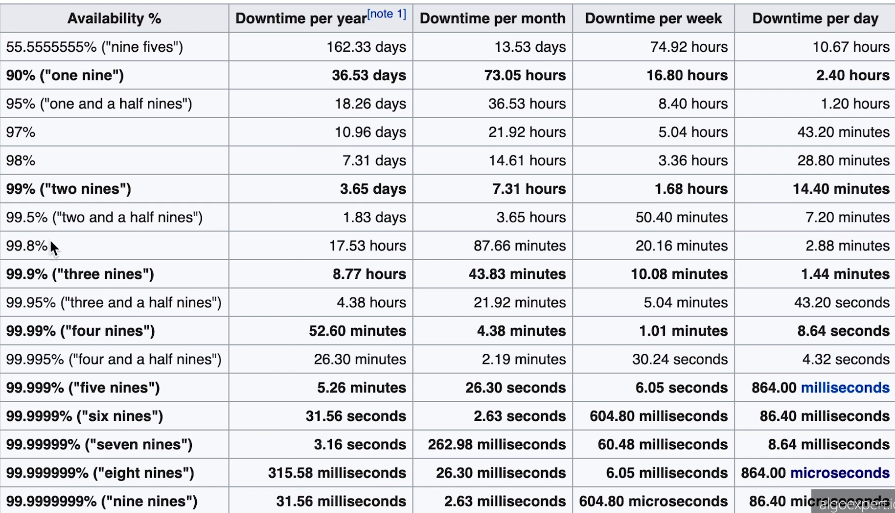

# Availability

## Overview
Availability can be a few different things. Availability is how resistant a system is to failures. what happens if a server fails, database. Is your system going to completely go down or is it going to fail. This is also known as **fault tolerance**. Availability can also be the percentage of time for a year or month where the system is functional enough where it can perform all of it's main tasks.

We can measure availability as a percentage of uptime for a given year. If a system had 50% uptime for a given year, you would say that the system had 50% availability. This is not that great. Even 90% is not that great. This amounts to about 36 days of downtime for the year, which for a company like Facebook, this would not be great.

## Nines
Nines are effectively percentages. If you had a system with 99% availability, you would say this is 2 nines of availability. If the system had 99.9% availability, you would say this is 3 nines of availability. 5 nines would be considered the gold standard of availability. If your system has 5 nines, you would say your system is **Highly Available (HA)**.


## SLA/SLO
SLA stands for service level agreement. An SLA is an agreement between the service provider and the end user about the systems availability, among other things. SLO is related, which stands for Service Level Objective. The availability percentage would be the SLO. If the service provider does not meet their SLO, you as the end user would recieve financial credit.

## How to improve availability
You want to make sure that your system doesn't have a single point of failure. You can resolve this by **redundancy**. Redundancy is the act of duplicating or multiplying certain parts of your system. **Passive redundancy** is when you have multiple components at a given layer of your system, and if at any point in time one of the parts of the system fails, the other parts of the layer pick up the load and continue working. An example of this would be an airplane twin engine. If one of those engines fail, the plane can still perform without much of a problem, the other engine just picks up the load.

## Key Terms
1. [Process](glossary.md#process) - A program that is currently running on a machine. You should always assume that any process may get terminated at any time in a sufficiently large system.
2. [Node/Instance/Host](glossary.md#node-instance-host) - These three terms refer to the same thing most of the time: a virtual or physical machine on which the developer runs processes. Sometimes the word **server* also refers to this same concept.
3. [Availability](glossary.md#availability) - The odds of a particular server or service being up and running at any point in time, usually measured in percentages. A server that has 99% availability will be operational 99% of the time (this would be described as having two **nines** of availability).
4. [High Availability](glossary.md#high-availability) - Used to describe systems that have particularly high levels of availability, typically 5 nines or more; sometimes abbreviated "HA".
5. [Nines](glossary.md#nines) - Typically refers to percentages of uptime. For example, 5 nines of availability means an uptime of 99.999% of the time. Below are the downtimes expected per year depending on those 9s.
   ```
   - 99% (two 9s): 87.7 hours
   - 99.9% (three 9s): 8.8 hours
   - 99.99%: 52.6 minutes
   - 99.999%: 5.3 minutes
   ```
6. [Redundancy](glossary.md#redundancy) - The process of replicating parts of a system in an effort to make it more reliable.
7. [SLA](glossary.md#sla) - Short for "service-level agreement", an SLA is a collection of guarantees given to a customer by a service provider. SLAs typically make guarantees on a system's availability, amongst other things. SLAs are made up of one or multiple SLOs.
8. [SLO](glossary.md#slo) - Short for "service-level objective", an SLO is a guarantee given to a customer by a service provider. SLOs typically make guarantees on a system's availability, amongst other things. SLOs constitute an SLA.
