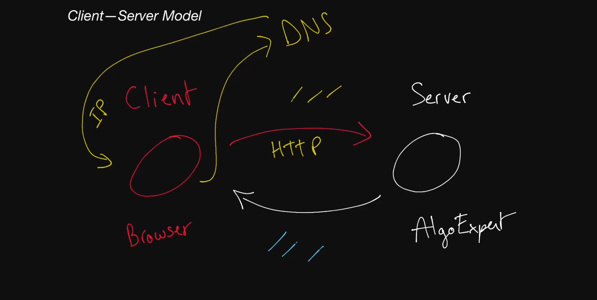
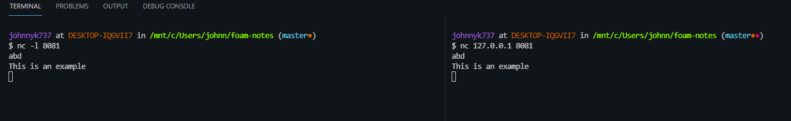

# Client-Server model

## Overview
A basic definition of each would be that a client is what requests something from a server. A server provides data back to the client. Typically the browser can be thought of as the Client. 

## Client/Browser
The client/browser doesn't really know what the server is. It knows that it can communicate with it, but it doesn't know what the server represents. When you type a URL in the URL bar, it doesn't know how to talk to the server initially. What happens after you click enter, it calls DNS query which is able to map the URL to an IP address and give it back to the browser.

 - DNS query - special request that goes to a predetermined set of servers and asks what the IP address of X URL/Website.
 - IP address - a unique identifier for a machine.

All computers connected to the internet have ways to discover routes to IP addresses, which means they can send data to IP addresses. You can think of an IP address as a mailbox that has been granted to a machine.

After the IP address has been retrieved, the browser can call an HTTP request, which is then sent to the server. This request will also include your own IP address (source IP address) so that the server knows where to send the response.

A server normally listens to specific ports for requests. Any machine normally has about 65k ports they can listen to. As the client, you have to specify which port you want to communicate on. Using the mailbox analogy, think about the IP address as the mailbox to an apartment complex and the ports are each apartment number in the complex. Most clients know what port to use depending on the protocol. Typically if a client is trying to speak with the HTTP protocol, the port is normally 80. If it's the HTTPS protocol, the port is normally 443. These were decided on a long time ago.

## Visualizing 

On the left is the reader, the right is the writer. We can write anything on the right side, and after we hit `enter`, we will see it on the left. 

 - `nc` stands for NetCat. This is a tool that allows you to read from or write to network connections.
 - `-l` stands for listen which takes a port (default host is localhost).

## Key Terms
1. [Client](glossary.md#client) - A machine or process that requests data or service from a server
   > A single machine or piece of software can be both a client and a server at the same time. For instance, a single machine could act as a server for end users and as a client for a database.
2. [Server](glossary.md#server) - A machine or process that provides data or service for a client, usually by listening for incoming network calls.
   > A single machine or piece of software can be both a client and a server at the same time. For instance, a single machine could act as a server for end users and as a client for a database.
3. [Client-Server model](glossary.md#client-server-model) - The paradigm by which modern systems are designed, which consists of clients requesting data or service from servers and servers providing data or service to clients. 
4. [IP Address](glossary.md#ip-address) - An address given to each machine connected to the public internet. IPv4 addresses consist of four numbers separated by dots (eg. a.b.c.d) where all four numbers are between 0 and 255. Special values include: 
   - **127.0.0.1**: Your own local machine, also referred to as **localhost**
   - **192.168.x.y**: Your private network. For instance, your machine and all machines on your private wifi network will usually have the 192.168 prefix.
5. [Port](glossary.md#port) - In order for multiple programs to listen for new network connections on the same machine without colliding, they pick a **port** to listen on. A port is an integer between 0 and 65,535 (216 ports total). Typically, ports 0 - 1023 are reserved for *system ports* (also called *well-known* ports) and shouldn't be used by user-level processes. Certain ports have pre-defined uses, and although you usually won't be required to have the memorized, they can sometimes come in handy. Some examples are: 
   - 22: Secure Shell
   - 53: DNS lookup
   - 80: HTTP
   - 443: HTTPS
6. [DNS](glossary.md#dns) - Short for Domain Name System, it describes the entities and protocols involved in the translation from domain names to IP addresses. Typically, machines make a DNS query to a well known entity which is responsible for returning the IP address (or multiple ones) of the requested domain name in the response.
