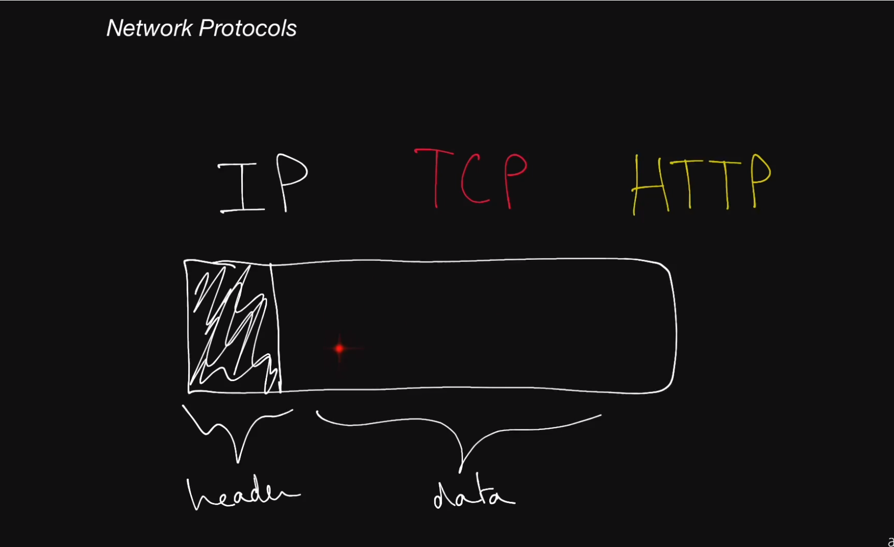
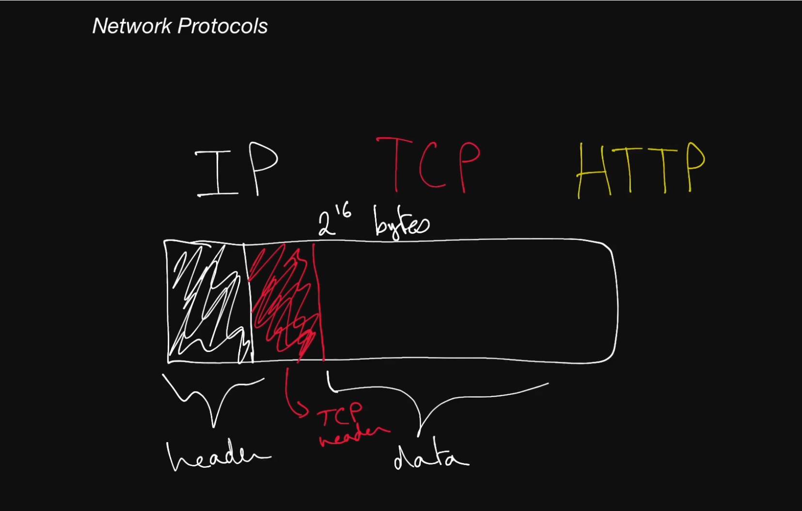

# Network Protocols

A **protocol** is an agreed upon set of rules for an interaction between two parties. An example of this is two people who know each other are walking down the same hallway. They engage in a handshake and small talk, then once done, they can continue or stop and continue walking. The **network protocol** consists of: 
 - The kinds of messages recieved by clients and servers
 - The format of those messages/how they are structured
 - The order of those messages
 - whether or not there should be some sort of response.

There are a lot of protocols out there and the majority are not necessary to know. The important ones are: IP, TCP, and HTTP

### IP
IP stands for **Internet Protocol**. In the context of System interviews, all you should need to know is that the modern internet effectively runs on IP. This means that when a client attemps to interact with a server an sends data, that data is sent in what is known as an IP packet. IP packets are the building blocks of communication of machines over the internet. IP packets are made up of bytes. It is important to know that IP packets have two main sections: IP Header, and the data.


- IP Header
The section of an IP packet that is in the beginning of the packet. It contains useful information about the packet. Specifically, the source IP address (the client requesting data), the destination IP address (the server the packet is going to), total size of the packet, and the version of the internet protocol. The total header size is between 20 and 60 bytes.
- IP Data
This where the information that a machine is trying to send to another machine will be stored.
- IP Versions
  - IPv4
  - IPv6

IP packets are limited to 2<sup>16</sup> bytes in size, which is about 65k bytes. This is not very much information in the current age. Normally, you would need to send in multiple packets to transfer information. 

## TCP
Built on top of IP, stands for Transmission Control Protocol. It is meant to solve the issues with IP
 - Allows guaranteed order for packets
 - Reliability. You can guarantee your packets will make it to the destination or you will know if the packets are failing to get receieved.
 - Error free. If your packets get corrupted during transmission, it will know and will allow the resending of packets in an uncorrupted way. 

TCP is used widely because of these factors. 

In the IP packet, the TCP header is within the data section. The TCP header has the information above. 



The core idea behind TCP is if two computers are wanting to communicate with each other, it's first going to create a TCP connection. This is called a **handshake**. A handshake is a special interaction where one computer sends a packet asking if they could connect. The other computer says 'ok' and sends the response. The client re-sends a response saying they have an open connection or *socket*. The two machines are then able to send information freely. 

## HTTP
Built on top of TCP, stands for **HyperText Transfer Protocol**. It introduces a higher level abstraction above TCP and IP, which is the *Request/Response* paradigm. This paradigm makes it really easy for developers to create robust and easy to maintain systems. We completely forget about IP packets and TCP. 

Requests have a lot of properties as compared to IP/TCP. They are essentially objects with important fields that describe them. 

## Key Terms
1. [IP](glossary.md#ip) - Stands for **Internet Protocol**. This network protocol outlines how almost all machine-to-machine communications should happen in the world. Other protocols like **TCP**, **UDP** and **HTTP** are built on top of IP.
2. [TCP](glossary.md#tcp) - Network protocol built on top of IP. Allows for ordered, reliable data delivery between machines over the public internet by creating a **connection**. TCP is usually implemented in the kernel which exposes **sockets** to applications that they can use to stream data through an open connection.
3. [HTTP](glossary.md#http) - The HyperText Transfer Protocol is a very common network protocol implemented on top of TCP. Clients make HTTP requests and servers respond with a response. Requests typically have the following schema:
   ```
   host: string (example: google.com)
   port: integer (example: 80 or 443)
   method: string (example: GET, PUT, POST, DELETE, OPTIONS or PATCH)
   headers: pair list (example: "Content-Type" => "application/json")
   body: opaque sequence of bytes
   ```
   Responses typically have the following schema:
   ```
   status code: integer (example: 200, 401, 404)
   headers: pair list (example: "Content-Length" => 1238)
   body: opaque sequence of bytes
   ```

4. [IP Packet](glossary.md#ip-packet) - Sometimes more boradly referred to as just a network packet, an IP packet is effectively the smallest unit used to describe data being sent over IP, aside from bytes. An IP packet consists of:
   - an **IP header**, which contains the source and destination **IP addresses** as well as other information related to the network.
   - a **payload**, which is just the data being sent over the network.
