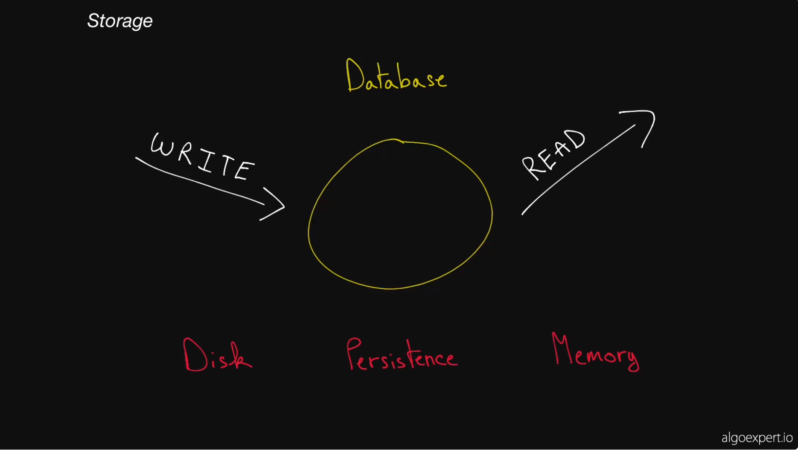

# Storage

## Databases
Databases is a thing that serves two purposes: store and retrieve data. A common misconception is thinking that a database is just a box that lives in the ether. What it *usually* is is just a server.

An important concept behind databases is persistance. A common misconception is that if you store information in a database that the information is persisted. If there is a network issue or a power outage, the assumption is that the data will still be there. In many cases, there are ensurances that the data **will** be persisted, however that may not always be the case. This brings us to two types of storage: Disk and Memory.

Saving to disk is basically what happens when your computer save a file on your computer. This data will be persisted even after shutdown unless there is some corruption or issue with your disk.

If your database writes data in memory, which is where you have an array holding data in the database logic code. If the database shuts down during the process, that information is lost. This type of storage is much quicker than disk.

Storage is very complicated because it has a lot of breadth and a lot of depth. If you take Google Cloud Platform, they offer 8 different storage products.

There are a lot of different things databases can offer you. For example, does a db impose a structure or schema on the data (relational db) or does it not. There is also uptime or availability considerations. Distributed databases are also used for situations where you want to not worry about loss of data. This gets complicated when deciding how to distribute the data. Do you split it up so your data is in multiple machines. How do you do this? Do you replicate it? If so, how do you handle consistency (Refers to staleness or up to dateness of the data). There are many options and they all have their own tradeoffs.

## Key Terms
1. [Databases](glossary.md#databases) - Databases are programs that either use disk or memory to do 2 core things: **record** data and **query** data. In general, they are themselves servers that are long lived and interact with the rest of your application through netowrk calls, with protocols on to pof TCP or even HTTP.  Some databases only keep record in memory, and the users of such databases are aware of the fact that those record may be lost forever if the machine or process dies. For the most part though, databases need persistence of those records, and thus cannot use memory. This means that you have to write your data to disk. Anything written to disk will remain through power loss or network partitions, so that's what is used to keep permanent records. Since machines die often in a large scale system, special disk partitions or volumes are used by the database process, and thos volumes can get recovered even if the machine were to go down permanently.
2. [Disk](glossary.md#disk) - Usually refers to either **HDD (Hard-Disk Drive)** or **SSD (Solid-State Drive)**. Data written to disk will persist through power failures and general machine crashes. Disk is also referred to as **non-volatile storage**. SSD is far faster than HDD but also far more expensive from a financial point of view. Because of that, HDD will typically be used for data that's rarely accessed or updated, but that's stored for a long time, and SSD will be used for data that's frequently accessed and updated.
3. [Memory](glossary.md#memory) - Short for **Random Access Memory (RAM)**. Data stored in memory will be lost when the process that has written that data dies.
4. [Persistent Storage](glossary.md#persistent-storage) - Usually refers to disk, but in general it is any form of storage that persists if the process in charge of managing it dies.
